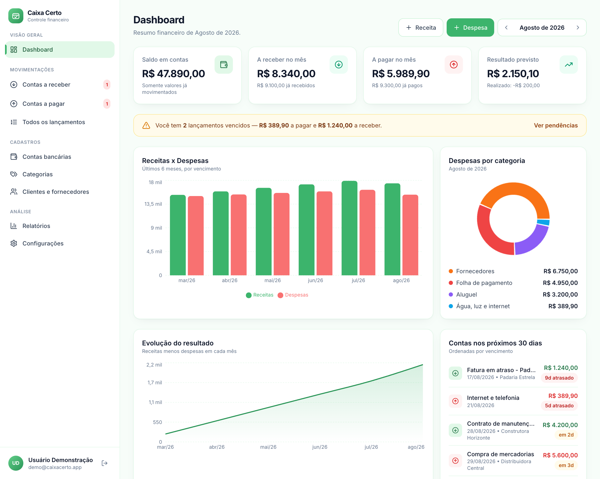
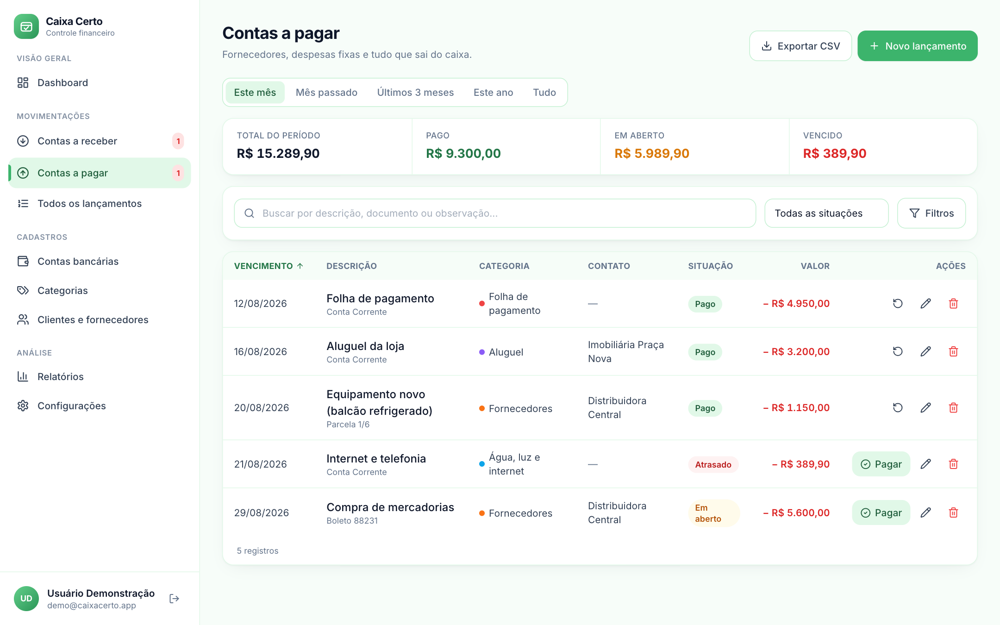
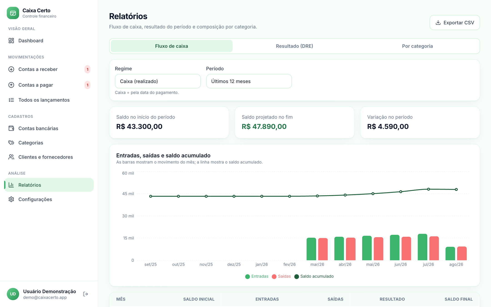
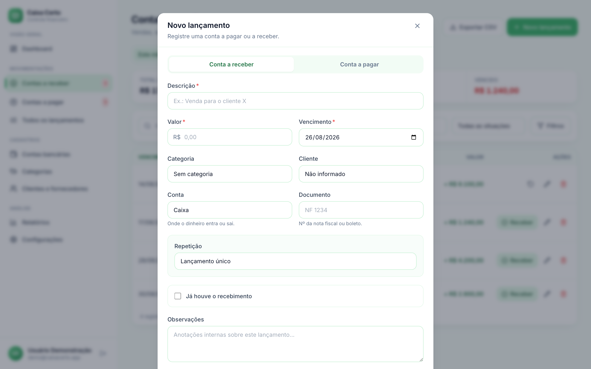
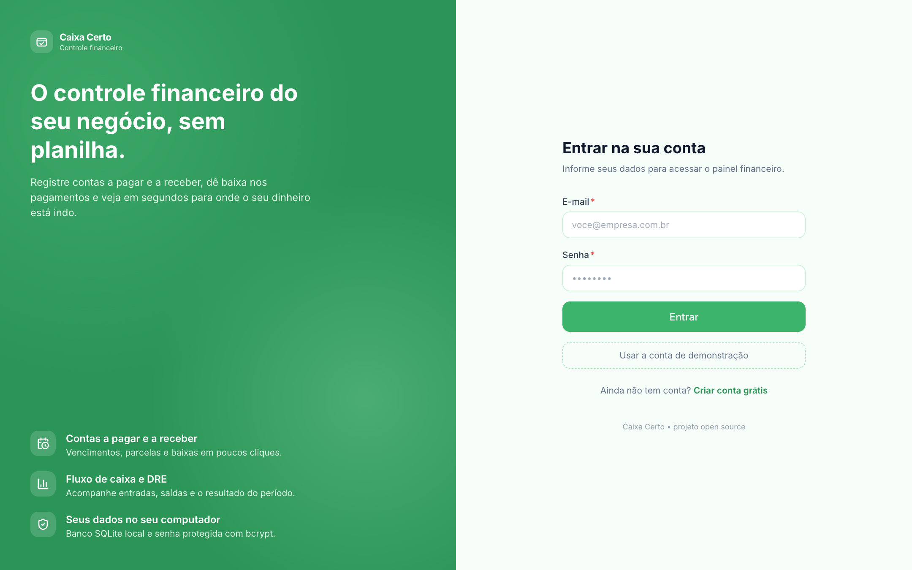
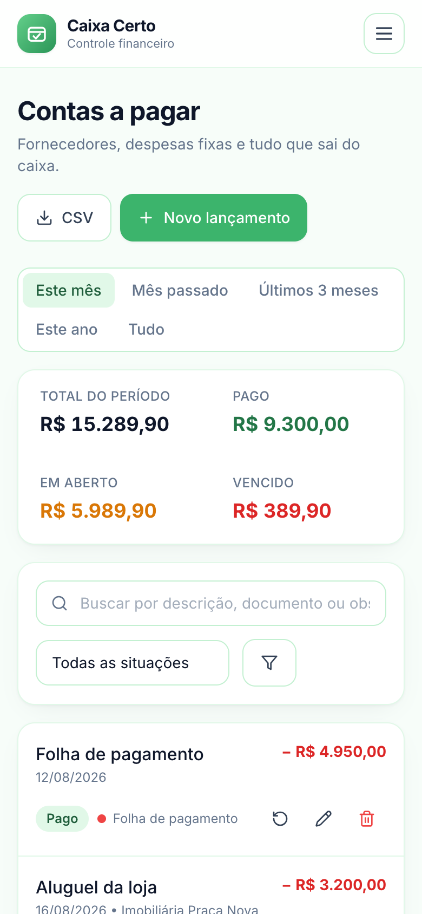

<h1 align="center">💚 Caixa Certo — Interface</h1>

<p align="center">
  Painel financeiro do <strong>Caixa Certo</strong>: contas a pagar, contas a receber,
  fluxo de caixa e relatórios.<br>
  React, Vite e Tailwind CSS.
</p>

<p align="center">
  
  
  
  
</p>

<p align="center">
  👉 <strong>API do sistema:</strong>
  <a href="https://github.com/engericgarcia/caixa-certo-api">engericgarcia/caixa-certo-api</a>
</p>

---

## 📸 Telas

<p align="center">
  
</p>

<p align="center">
  
  
</p>

<p align="center">
  
  
</p>

<p align="center">
  
</p>

---

## ✨ Telas do sistema

| Tela | O que faz |
| --- | --- |
| **Dashboard** | Saldo consolidado, valores a pagar e a receber no mês, resultado previsto x realizado, alerta de vencidos e três gráficos: receitas x despesas, evolução do resultado e composição das despesas. Permite lançar receita ou despesa sem sair da tela. |
| **Contas a pagar / a receber** | Listagem com atalhos de período, busca, filtros e ordenação clicando no cabeçalho. Baixa de pagamento com data e valor (aceita juros e desconto), estorno e exclusão. |
| **Novo lançamento** | Um lançamento pode virar *N* parcelas (divide o valor) ou *N* repetições mensais (repete o valor). |
| **Cadastros** | Contas bancárias com saldo calculado, categorias com cores e clientes/fornecedores com o total em aberto de cada um. |
| **Relatórios** | Fluxo de caixa com saldo acumulado, DRE simplificado e composição por categoria — em regime de caixa ou competência. |

**Detalhes de interface:** contador de vencidos no menu lateral, esqueletos de
carregamento, exportação para CSV, formatação em pt-BR e layout que vira lista de
cards no celular.

## 🛠️ Tecnologias

[React 18](https://react.dev) + [Vite](https://vite.dev) ·
[React Router](https://reactrouter.com) · [Tailwind CSS](https://tailwindcss.com) com
paleta verde personalizada · [Recharts](https://recharts.org) para os gráficos ·
[Lucide](https://lucide.dev) para os ícones

---

## 🚀 Como rodar

**Pré-requisitos:** [Node.js 18.18+](https://nodejs.org) e a
[API](https://github.com/engericgarcia/caixa-certo-api) rodando em `http://localhost:4000`.

```bash
git clone https://github.com/engericgarcia/caixa-certo-web.git
cd caixa-certo-web

npm install
npm run dev
```

A interface abre em **http://localhost:5173**.

> **Conta de demonstração** (criada pelo `npm run seed` da API)
> **E-mail:** `demo@caixacerto.app` · **Senha:** `demo1234`
>
> Prefere começar do zero? Clique em *Criar conta grátis* — a conta nova já nasce
> com as categorias padrão e uma conta "Caixa".

Em desenvolvimento não é preciso configurar nada: o Vite encaminha `/api` para
`http://localhost:4000` automaticamente. Se a sua API estiver em outra porta, crie um
`.env` a partir do `.env.example` e ajuste o `VITE_API_PROXY`.

### Scripts

| Comando | O que faz |
| --- | --- |
| `npm run dev` | Sobe a interface com recarregamento automático |
| `npm run build` | Gera o site otimizado em `dist/` |
| `npm run preview` | Serve o `dist/` localmente, para conferir o build |

---

## ☁️ Deploy na Vercel

O frontend é um site estático, então funciona bem em qualquer host de estáticos.
Na Vercel:

1. **Add New → Project** e importe este repositório
2. A Vercel detecta o Vite sozinha (build `npm run build`, saída `dist`)
3. Em **Environment Variables**, adicione:

   | Nome | Valor |
   | --- | --- |
   | `VITE_API_URL` | `https://SUA-API.onrender.com/api` |

4. **Deploy**

> ⚠️ Dois cuidados que evitam 90% dos problemas:
> - O `VITE_API_URL` precisa **terminar em `/api`** e **não** ter barra no final
> - A API precisa liberar o domínio da Vercel no `CORS_ORIGIN` dela, senão o
>   navegador bloqueia as chamadas
>
> Variável de ambiente do Vite só entra no código **durante o build** — depois de
> alterá-la, é preciso refazer o deploy.

---

## 📁 Estrutura

```
caixa-certo-web/
├── .env.example
├── index.html
├── vite.config.js          # proxy de desenvolvimento e divisão de chunks
├── tailwind.config.js      # paleta verde e animações
└── src/
    ├── main.jsx            # ponto de entrada
    ├── App.jsx             # rotas públicas e privadas
    ├── api/client.js       # cliente HTTP com o token JWT
    ├── components/         # UI reutilizável, layout e formulários
    ├── context/            # sessão do usuário e notificações
    ├── pages/              # uma página por tela do menu
    └── utils/format.js     # moeda, datas e prazos em pt-BR
```

## 🧠 Decisões de projeto

- **Sessão no `localStorage`.** O token fica salvo e é revalidado no boot; qualquer
  resposta `401` limpa a sessão e devolve o usuário ao login.
- **Datas sem fuso.** As datas trafegam como texto `AAAA-MM-DD` e são formatadas por
  manipulação de string, evitando o clássico erro de um dia a menos ao converter
  para `Date`.
- **Uma tela, três usos.** "Contas a pagar", "Contas a receber" e "Todos os
  lançamentos" são o mesmo componente, mudando apenas o tipo e os textos.
- **Painel em uma chamada.** O dashboard busca tudo de `/api/dashboard`, em vez de
  disparar seis requisições e montar os números no navegador.

## 🗺️ Próximos passos

- [ ] Testes de componente (Vitest + Testing Library)
- [ ] Modo escuro
- [ ] Atalhos de teclado para lançar mais rápido
- [ ] Anexar comprovantes aos lançamentos

## 📄 Licença

[MIT](LICENSE).
